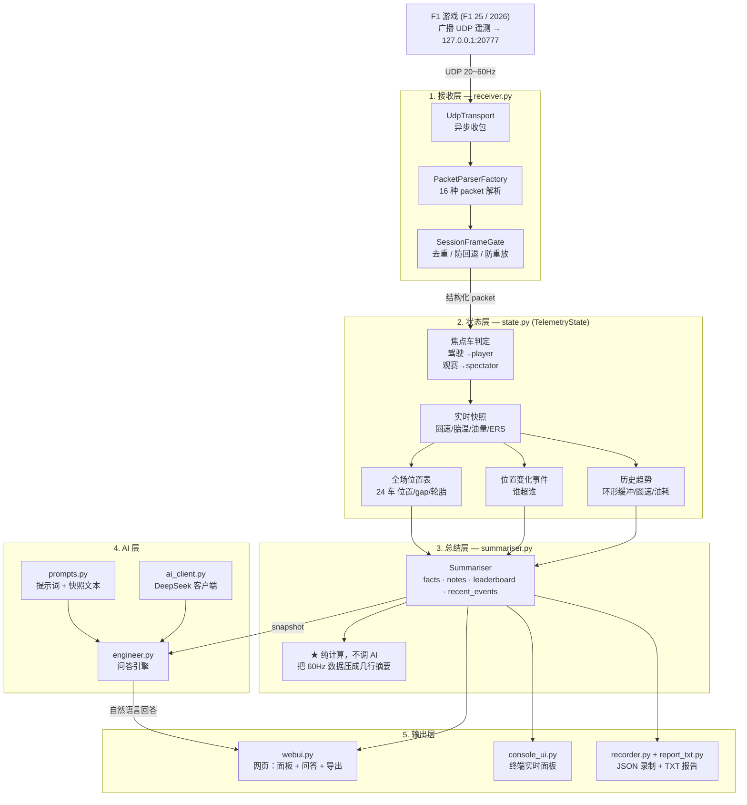

# F1 Race Engineer — 项目设计文档

> 基于 F1 游戏 UDP 遥测的 AI 赛车工程师助手。
> 实时解析遥测 → 结构化总结 → 自然语言问答（语音/文字）。

---

## 一、项目目标

做一个安静运行在后台的"外挂大脑"：**读取 F1 游戏广播的遥测数据，把它压缩成人类和 AI 都能理解的信息，并通过自然语言回答车手关于当前比赛状况的提问。**

核心定位是**情报官 / 策略台**，不是自动驾驶：

- ✅ 读取并分析遥测，告诉你"胎温如何、油够不够、跟前车差多少"
- ✅ 用工程师口吻给出判断与建议
- ❌ 不做任何替玩家操作车辆的行为（不注入、不挂钩、不模拟按键）

---

## 二、设计原则

| 原则 | 说明 |
|---|---|
| **被动接收** | 只监听游戏主动广播的 UDP 数据，不碰游戏进程、不注入内存、不挂钩 |
| **AI 不在实时回路** | 遥测 60Hz，AI 秒级延迟。AI 只处理"事件触发"的低频问答，绝不进数据主循环 |
| **数据先压缩再喂 AI** | 不把原始遥测丢给大模型，而是先压成结构化摘要。省 token、提准确率 |
| **单进程、零重依赖** | 不用 Flask/FastAPI，标准库 `http.server`；AI 调用用标准库 `urllib`。降低部署门槛 |
| **确定性优先** | 能用本地规则算的（圈速、油耗、排名）绝不交给 AI 猜；AI 只负责"翻译成人话" |
| **异常不致命** | 单包解析失败只丢弃该包，绝不中断主循环（应对游戏版本更新带来的未知字段） |

---

## 三、整体框架



---

## 四、模块说明

### 1. 接收层

| 文件 | 职责 |
|---|---|
| `receiver.py` | 单进程异步收包；驱动解析工厂；帧门限流 |
| `lib/socket_receiver/` | UDP 传输（从 pits-n-giggles 抽取，去掉了 IPC/TCP） |
| `lib/telemetry_manager/` | 解析工厂 + 帧门（`PacketParserFactory` / `SessionFrameGate`） |
| `lib/f1_types/` | 16 种 F1 packet 的二进制解析类（F1 2023–2026） |

**支持 packet 类型**：Motion / Session / LapData / Event / Participants /
CarSetups / CarTelemetry / CarStatus / FinalClassification / LobbyInfo /
CarDamage / SessionHistory / TyreSets / MotionEx / TimeTrial / LapPositions /
CarTelemetry2（2026 新增，主动空动 + Overtake）。

### 2. 状态层

| 文件 | 职责 |
|---|---|
| `state.py` | `TelemetryState`：聚合所有解析后的数据 |

**关键能力**：
- **焦点车判定**：驾驶时用 `playerCarIndex`；观赛时用 `spectatorCarIndex`
- **全场位置表**：join `LapData`(位置/gap) + `Participants`(车手名) + `CarStatus`(轮胎)
- **事件追踪**：位置升降 → 记录"被 X 超过""超过 X"
- **趋势分析**：`LapDeltaManager`(delta) + `FuelRateRecommender`(油耗) + 环形缓冲
- **容错**：单包异常被捕获，记录到 `packet_errors`，不中断

### 3. 总结层

| 文件 | 职责 |
|---|---|
| `summariser.py` | 把 snapshot 压成 `facts` + `notes` + `leaderboard` + `recent_events` |

**这是全项目的核心**：AI 答得好不好，取决于这一层算得准不准。所有
"这个圈慢在哪""油够不够"的判断，**都在这里用本地规则算好**，AI 只负责润色成口语。

### 4. AI 层

| 文件 | 职责 |
|---|---|
| `ai_client.py` | DeepSeek API 客户端（标准库实现，支持 reasoning 模型） |
| `prompts.py` | 系统提示词 + 快照文本构造（控制 token 成本） |
| `engineer.py` | 问答引擎：快照 + 问题 → 提示词 → AI → 回答 |

**省 token 设计**：
- 不喂原始遥测，只喂压缩后的 facts + notes
- 全场排名只喂"前几名 + 你自己 + 前后邻居"
- 对话历史只保留最近 4 条
- 单次请求约 200–750 tokens

### 5. 输出层

| 文件 | 职责 |
|---|---|
| `console_ui.py` | 终端实时面板（无依赖，ANSI 刷新） |
| `webui.py` | 网页 UI：遥测面板 + 问答框 + 全场排名 + 导出按钮 |
| `recorder.py` | 会话录制：每圈摘要 + 对话记录 → `sessions/*.json` |
| `report_txt.py` | 人类可读 TXT 报告（圈速表 + 全场排名 + 对话） |

### 入口

| 文件 | 说明 |
|---|---|
| `run.py` | 主入口（`--web` 网页 / 默认终端面板） |
| `启动.bat` | 一键启动：起服务 + 自动开浏览器 |

---

## 五、功能需求

### 已实现

| 功能 | 状态 |
|---|---|
| F1 2026 格式 UDP 解析（24 车） | ✅ |
| 实时遥测快照（圈速/胎温/油量/ERS/DRS/空动/Overtake） | ✅ |
| 圈速历史 + 分段计时 | ✅ |
| vs 最快圈 delta | ✅ |
| 油耗率 + 剩余圈数 + 完赛油预测 | ✅ |
| 全场位置表（位置/车手/圈数/轮胎/胎龄/gap） | ✅ |
| 位置变化事件（超车/被超） | ✅ |
| AI 自然语言问答（工程师语气，诚实不编造） | ✅ |
| 网页 UI（遥测面板 + 问答 + 全场排名） | ✅ |
| 终端面板 UI | ✅ |
| 会话录制（JSON） + 人类可读报告（TXT） | ✅ |
| 观赛模式（焦点跟随被观看车辆） | ✅ |
| 单包异常容错 | ✅ |

### 规划中

| 功能 | 说明 |
|---|---|
| **STT 语音输入** | 按键触发 → 录音 → 语音转文字（先云端，后本地 whisper） |
| **TTS 语音输出** | AI 回答 → 语音播报 |
| **比赛/计时双模式切换** | 按模式切换总结脚本读取的数据分类 |
| **分段对比** | 本圈各段 vs 最快圈各段，回答"慢在哪一章" |
| **可配置阈值** | 把告警阈值移出代码，做成配置 |

### 非目标（明确不做）

- 不做任何车辆操控（按键模拟/手柄注入）
- 不读取或修改游戏内存
- 不绕过反作弊
- 不提供对手的受限数据（游戏本身不广播）

---

## 六、关键技术决策

| 决策 | 理由 |
|---|---|
| **复用 pits-n-giggles 的 `f1_types`** | 省掉从零啃 16 种 packet 二进制结构；该库已适配 F1 2026 Season Pack |
| **不用它的多进程架构** | 原项目是 launcher + 多进程 + ZMQ + HUD + Web，对单一问答场景过重 |
| **单进程 + 标准库 HTTP** | 启动快、零配置、依赖少 |
| **AI 只做语言层** | 数值计算全本地，AI 不参与，保证准确、便宜、快 |
| **事件驱动问答** | 不做常驻监听，按键/打字触发，绕开实时性错配 |

---

## 七、已知问题与注意事项

1. **游戏设置陷阱**：改动游戏内"你的遥测"设置会导致 **UDP 广播失效，改回来也无法恢复**，必须**重启游戏**。请保持"受限"不动。
2. **对手精细数据不可得**：速度/胎温/油量等仅自己车有；对手只有位置/圈速/轮胎等公开数据（游戏设计限制）。
3. **联网玩家姓名**：对方关闭"显示在线名"时，只能拿到"车队#车号"。
4. **AI 推理开销**：DeepSeek 两个可用模型均为推理模型，复杂问题会先"思考"，延迟和 token 成本略高。
5. **终端中文显示**：Windows 控制台需 `chcp 65001` 或设 `PYTHONIOENCODING=utf-8`。

---

## 八、运行方式

```bash
# 网页模式（推荐）
py -3.12 run.py --web
# 然后浏览器打开 http://127.0.0.1:8765

# 终端面板
py -3.12 run.py

# 一键启动（Windows）
双击 启动.bat
```

配置（`.env`）：

```
DEEPSEEK_API_KEY=sk-...
DEEPSEEK_BASE_URL=https://api.deepseek.com
DEEPSEEK_MODEL=deepseek-flash
```

---

## 九、数据流示例

```
游戏 UDP 包
  → PacketParserFactory.parse()          # 二进制 → 对象
  → TelemetryState.process()             # 对象 → 状态聚合
  → Summariser.summarise()               # 状态 → facts/notes
  → prompts.build_messages()             # 摘要 → 提示词
  → DeepSeekClient.chat()                # 提示词 → 自然语言
  → WebUI / Console                      # 回答 → 屏幕/语音
```

---

## 十、许可证与致谢

- 本项目复用 [pits-n-giggles](https://github.com/ashwin-nat/pits-n-giggles)（MIT）的
  `f1_types` / `socket_receiver` / `telemetry_manager` / `delta` / `fuel_rate_recommender`
  等模块，遵循其 MIT 许可证。
- AI 能力由 DeepSeek API 提供。
