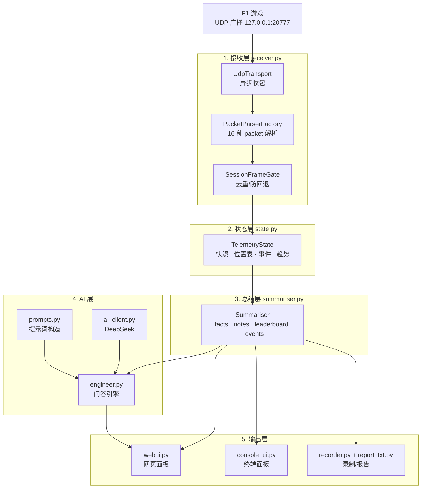

# F1 Race Engineer

> 一个安静运行在后台的 **AI 赛车工程师**：读取 F1 游戏广播的遥测数据，把它压缩成结构化信息，并用自然语言回答车手关于当前比赛状况的提问。

读取 UDP 遥测 → 结构化总结 → AI 自然语言问答。**只给情报和建议，不碰车辆操控。**

---

## 特性

- 🏎 **实时遥测解析** — 支持 F1 2023–2026 全部 16 种 UDP packet，适配 2026 Season Pack（24 车）
- 📊 **全场位置表** — 位置 / 车手 / 圈数 / 轮胎 / 胎龄 / 差距
- ⏱ **圈速分析** — 圈速历史、分段计时、vs 最快圈 delta
- ⛽ **油耗预测** — 消耗率、剩余圈数、完赛油量预测
- 🌡 **轮胎监控** — 胎温 / 胎压 / 磨损趋势
- 🎙 **AI 问答** — 用工程师口吻回答"胎温怎么样""油够不够""跟前车差多少"，诚实不编造
- 📡 **观赛模式** — 焦点自动跟随被观看的车辆
- 📝 **会话录制** — 自动生成 JSON（原始）+ TXT（可读）报告
- 🖥 **双界面** — 网页面板 + 终端面板

---

## 快速开始

### 1. 环境

- Windows
- Python 3.12 / 3.13

### 2. 配置

编辑项目根目录的 `.env`：

```
DEEPSEEK_API_KEY=sk-你的key
DEEPSEEK_BASE_URL=https://api.deepseek.com
DEEPSEEK_MODEL=deepseek-flash
```

### 3. 游戏设置

F1 游戏内 **设置 → UDP 遥测**：

| 项 | 值 |
|---|---|
| UDP 遥测 | **开启** |
| UDP IP | `127.0.0.1` |
| UDP 端口 | `20777` |
| UDP 频率 | **20Hz**（推荐：面板与问答完全够用，数据量与解析开销仅为 60Hz 的 1/3） |
| UDP 赛制 | **2026**（或与你游戏版本对应）|
| 你的遥测 | **受限** ⚠️ |

> ⚠️ **重要**：不要改动"你的遥测"设置。实测改动后会导致 UDP 广播失效（改回来也无法恢复），必须**重启游戏**才能恢复。

### 4. 运行

```bash
# 推荐：网页模式
py -3.12 run.py --web
# 浏览器打开 http://127.0.0.1:8765

# 终端面板
py -3.12 run.py
```

或直接**双击 `启动.bat`**（自动启动服务 + 打开浏览器）。

---

## 使用

启动后进游戏跑圈：

- **左侧面板**：实时遥测 + 全场排名
- **右侧**：车队无线电问答框（快捷按钮 或 打字提问）
- **导出**：右上角按钮导出 TXT / JSON 报告
- **自动录制**：每次运行的数据自动存到 `sessions/`

---

## 架构



详见 [DESIGN.md](DESIGN.md)。

---

## 项目结构

```
F1_TR/
├── run.py              主入口（--web / 终端）
├── receiver.py         单进程 UDP 收包 + 解析调度
├── state.py            遥测状态聚合（快照/位置表/事件/趋势）
├── summariser.py       总结层：把状态压成 facts + notes
├── ai_client.py        DeepSeek API 客户端
├── prompts.py          系统提示词 + 快照文本构造
├── engineer.py         问答引擎
├── webui.py            网页 UI
├── console_ui.py       终端 UI
├── recorder.py         会话录制
├── report_txt.py       TXT 报告生成
├── 启动.bat            一键启动
├── lib/                核心库
│   ├── f1_types/           16 种 F1 packet 解析（2023–2026）
│   ├── socket_receiver/    UDP 传输
│   ├── telemetry_manager/  解析工厂 + 帧门
│   ├── delta/              圈速 delta
│   └── fuel_rate_recommender.py / rolling_history.py
└── sessions/           自动生成的会话记录（运行时产生）
```

---

## 非目标

明确**不做**：

- ❌ 车辆操控（按键模拟 / 手柄注入）
- ❌ 读取或修改游戏内存
- ❌ 绕过反作弊
- ❌ 提供游戏本身不广播的数据

本项目**只被动接收**游戏官方广播的 UDP 数据，不做任何注入或挂钩。

---

## 技术栈

- **Python 3.12**，接收/解析/HTTP 服务全部**标准库**（无 Flask/FastAPI 依赖）
- **DeepSeek API** 提供语言能力
- 遥测解析复用 [pits-n-giggles](https://github.com/ashwin-nat/pits-n-giggles)（MIT）

---

## License

MIT（复用 pits-n-giggles 的模块遵循其 MIT 许可）

## 致谢

- [pits-n-giggles](https://github.com/ashwin-nat/pits-n-giggles) — F1 遥测解析库
- [DeepSeek](https://deepseek.com) — AI 语言能力
