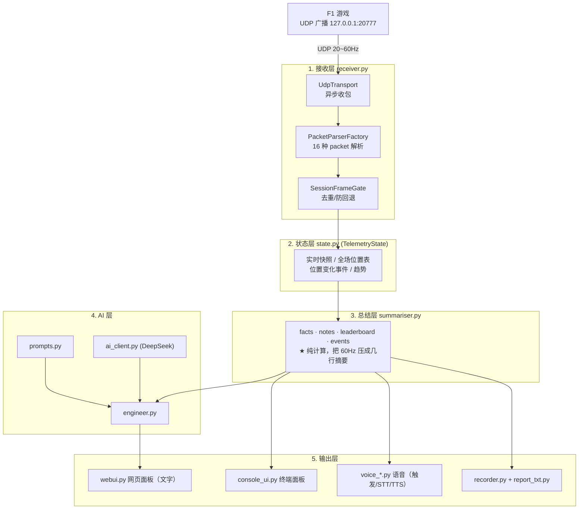

# F1 Race Engineer

> 一个安静运行在后台的 **AI 赛车工程师**：读取 F1 游戏广播的遥测数据，把它压缩成结构化的信息，然后通过**语音或文字**回答车手关于当前比赛状况的问题。

**[ 读遥测 → 结构化总结 → AI 问答 → 语音播报 ]**

只给情报和建议，**不碰车辆操控**。

---

## 特性

- 🏎 **实时遥测解析** — 支持 F1 2023–2026 全部 17 种 UDP packet，适配 2026 Season Pack（24 车）
- 📊 **全场位置表** — 位置 / 车手 / 圈数 / 轮胎 / 胎龄 / 差距
- ⏱ **圈速分析** — 圈速历史、分段计时、vs 最快圈 delta、无效圈过滤
- ⛽ **油耗策略** — 消耗率、剩余圈数、完赛油量预测
- 🌡 **轮胎 + 损伤** — 胎温/胎压/磨损、前后翼/底板/引擎车损、进站状态
- ⚔ **战况感知** — 位置变化事件，由游戏官方 OVTK 超车事件驱动
- 🎙 **语音问答** — 按键说话 → 本地语音识别 → AI 回答 → 语音播报
- 🎧 **观赛模式** — 焦点自动跟随被观看的车辆
- 📝 **会话录制** — 自动生成 JSON（原始）+ TXT（可读）报告
- 🖥 **双界面** — 网页面板 + 终端面板
- 🔌 **多模型** — 任意 OpenAI 兼容端点（DeepSeek/OpenAI/本地 Ollama…），运行时可切换 + 故障回退
- ⚡ **本地快答** — "我P几/还剩几圈/油够不够"等问题不经过 AI，直接由遥测回答（零延迟、零成本）
- 🎚 **智能档位** — fast / standard / deep 三档，控制回答长度与深度
- 🔊 **音频设备热切换** — 网页面板选麦克风/耳机，拔插后自动重连

---

## 下载与安装

发布页提供两个包，按需选一个（**推荐先试轻量核心包**）：

| | **轻量核心包** `core` | **全量语音包** `full` |
|---|---|---|
| 体积 | 约 25 MB | 约 760 MB |
| 用法 | 解压 → 双击 `F1Engineer.exe` | 解压 → 双击 `启动.bat` |
| Python | 已内置，无需安装 | 已内置（embedded），无需安装 |
| 语音识别 | 云端 STT（填 key）+ SAPI 播报 | **本地 whisper，完全离线** |
| 适合 | 大多数人、首次尝试 | 想离线 / 隐私 / 不想买 STT 额度 |

两个包功能相同，只是语音识别后端不同。AI 未配置 key 时，**名次、圈速、油量、
胎温、损伤、前车差距等高频问题仍可回答**（本地规则，不经过 AI）。

> 下载后请核对发布页 `SHA256SUMS.txt` 中的校验值。

### 从源码运行（开发者）

- **Windows** + **Python 3.12 / 3.13**

```
py -3.12 -m pip install -e .
py -3.12 run.py --web
```

---

## 快速开始（源码）

### 1. 环境

- **Windows**
- **Python 3.12 / 3.13**

### 2. 配置

复制 `.env.example` 为 `.env`，填入你的 API key：

```
LLM_API_KEY=sk-你的key
LLM_BASE_URL=https://api.deepseek.com
LLM_MODEL=deepseek-flash
```

> 支持任意 **OpenAI 兼容**端点。旧的 `DEEPSEEK_*` 变量仍会被读取（作为回退），
> 现有 `.env` 无需改动即可继续使用。

### 3. 游戏设置

F1 游戏内 **设置 → UDP 遥测**：

| 项 | 值 |
|---|---|
| UDP 遥测 | **开启** |
| UDP IP | `127.0.0.1` |
| UDP 端口 | `20777` |
| UDP 赛制 | **2026**（或与你游戏版本对应）|
| 你的遥测 | **受限** ⚠️ |

> ⚠️ **重要**：不要改动"你的遥测"设置。实测改动后会导致 UDP 广播失效（改回来也无法恢复），必须**重启游戏**才能恢复。

### 4. 运行

```
# 网页模式（文字问答）
py -3.12 run.py --web
# 浏览器打开 http://127.0.0.1:8765

# 终端面板
py -3.12 run.py

# 语音模式（见下方"语音功能"）
py -3.12 voice_main.py

# 一键启动（Windows，网页模式）
双击 启动.bat
```

---

## 语音功能（可选）

语音采用**全本地**方案，按键说话，无需常驻监听。

**触发**：游戏中按 **小键盘 0**（按一下开始录音，再按一下结束）

**流程**：按键 → 录音 → 本地语音识别 → AI 问答 → 语音播报

### 启用步骤

**1. 安装本地语音依赖**（装到项目内的 `stt_lib/`，不污染全局）

```
py -3.12 -m pip install faster-whisper sounddevice --target stt_lib
```

**2. 下载语音模型**（下载到项目内的 `stt_models/`）

```
py -3.12 download_stt_model.py small
```

> 国内网络若下载失败，先设置镜像：
> `set HF_ENDPOINT=https://hf-mirror.com`

**3. 运行**

```
py -3.12 voice_main.py
```

**可选参数**：`--input <片段> --output <片段>`（按设备名片段选麦克风/输出）
修改触发键：编辑 `voice_trigger.py` 的 `TRIGGER_VK`。

**不知道设备叫什么名字？**

```
py -3.12 voice_main.py --list-audio
```

设备也可在 `.env` 里固定（`AUDIO_INPUT` / `AUDIO_OUTPUT`），或在网页面板的
`/api/audio` 运行时切换。设备名找不到时会**明确报错**，不会静默改用系统默认设备
（避免比赛时从音箱外放）。

> `stt_lib/` 和 `stt_models/` 体积较大，已在 `.gitignore` 中排除，需按上述步骤自行下载。

---

## 网页 API

网页面板（`run.py --web`）同时暴露一组 JSON 接口，方便脚本化或二次开发：

| 方法 | 路径 | 说明 |
|---|---|---|
| GET | `/api/state` | 当前总结 + 接收统计 + 语音状态 |
| POST | `/api/ask` | `{question}` → AI 回答（本地快答优先） |
| POST | `/api/ask_voice` | 上传音频 → 识别 → 回答 |
| GET | `/api/llm` | 当前端点 / 模型 / 档位 / 快答命中率 |
| POST | `/api/llm` | 热切换 `{base_url?, api_key?, model?}` |
| GET | `/api/models` | 列出端点支持的模型 |
| GET | `/api/profile` | 当前档位 + 可用档位 |
| POST | `/api/profile` | 热切换 `{profile: fast\|standard\|deep}` |
| GET | `/api/audio` | 列出麦克风/输出设备 + 当前选择 |
| POST | `/api/audio` | 热切换 `{input?, output?}` |
| GET | `/api/export` / `/api/export_txt` | 下载会话报告 |

**AI 档位**

| 档位 | 特点 | 适用 |
|---|---|---|
| `fast` | 一句话，禁止展开 | 比赛中快速确认 |
| `standard` | 现行默认 | 常规问答 |
| `deep` | 2-3 句，主动给策略权衡 | 冷思考 / 进站规划 |

> 三档只改**表达层**。所有数值计算始终在本地完成，AI 只负责措辞。

### 为什么用 Raw Input / 本地识别？

- **按键检测用 Windows Raw Input**（标准 API，只读，不注入、不挂钩、不映射），全屏游戏时仍可工作。手柄走 XInput 会被游戏独占，键盘不会。
- **语音识别用本地 faster-whisper**，数据不出本机。

---

## 架构



详见 [DESIGN.md](DESIGN.md)。代码评审见 [CODE_REVIEW.md](CODE_REVIEW.md)，已知问题见 [KNOWN_ISSUES.md](KNOWN_ISSUES.md)。

---

## 项目结构

```
F1_TR/
├── FI.py               一键启动（打包入口）：启动二选一（网页 / 语音）
├── run.py              命令行入口（--web 网页 / 终端面板）
├── paths.py            路径锚点 app_root()（源码 / PyInstaller / 绿色包通用）
├── app.py              组合根：统一装配 state/receiver/engineer/recorder
├── voice_main.py       语音入口（遥测 + 语音问答，单进程）
├── receiver.py         单进程 UDP 收包 + 解析调度
├── state.py            遥测状态聚合（快照/位置表/事件/趋势）
├── summariser.py       总结层：把状态压成 facts + notes
├── config.py           配置中心（.env + 运行时可改，带锁）
├── llm_client.py       OpenAI 兼容客户端 + make_llm（多端点 / 回退）
├── ai_client.py        兼容层（`DeepSeekClient` 等旧名字）
├── profiles.py         AI 档位（fast/standard/deep）+ 本地快答路由
├── audio.py            音频设备解析（列出 / 模糊匹配 / 热切换）
├── prompts.py          系统提示词 + 快照文本构造
├── engineer.py         问答引擎
├── webui.py            网页 UI
├── console_ui.py       终端 UI
├── recorder.py         会话录制
├── report_txt.py       TXT 报告生成
├── voice_trigger.py    Raw Input 按键触发（不注入/不挂钩）
├── voice_stt.py        本地 faster-whisper 语音识别
├── voice_tts.py        Windows SAPI 语音合成 + 播放
├── download_stt_model.py  下载语音模型到项目内
├── build_release.ps1   构建两个发布包（轻量 exe + 全量语音包）
├── version_info.txt    exe 版本元数据
├── RELEASE_SIGNING.md  代码签名申请指引
├── 启动.bat            一键启动（网页模式，自动选 embedded Python）
├── lib/                核心库
│   ├── f1_types/           16 种 F1 packet 解析（2023–2026）
│   ├── socket_receiver/    UDP 传输
│   ├── telemetry_manager/  解析工厂 + 帧门
│   ├── delta/              圈速 delta
│   └── fuel_rate_recommender.py / rolling_history.py
└── sessions/           自动生成的会话记录（运行时产生）
```

---

## 兼容性

| 维度 | 支持范围 | 备注 |
|---|---|---|
| 操作系统 | Windows 10 1809+ / 11 x64 | Raw Input / SAPI / http.server 均原生 |
| 游戏 | F1 23 / 24 / 25 / 26（packet 2023–2026） | 未知新格式会被丢弃并计数，不会崩溃 |
| CPU（本地语音） | 需 AVX 指令集 | 老 CPU 请用云端 STT（`STT_PROVIDER=cloud`）|
| 语音零依赖路径 | 云端 STT + SAPI 播报 | 纯标准库，轻量核心包即可用 |
| AI | 任意 OpenAI 兼容端点 | DeepSeek / OpenAI / Moonshot / Qwen / 本地 Ollama |
| 端口 | UDP `20777` | 与 SimHub / CrewChief **互斥**（单消费者），同时用需转发 |
| 网络防火墙 | 绑定 `127.0.0.1` 不触发弹窗 | `--bind-ip 0.0.0.0` 会弹，属正常 |

---

## 会不会封号？（FAQ）

**结论：本项目当前形态在 EA AntiCheat 下的风险接近于零。**

- **只被动接收官方 UDP 广播**。UDP 遥测是游戏设置里的官方功能，SimHub / CrewChief
  等工具以此生态存在多年；收包不与游戏进程发生任何交互。
- **按键检测用 Windows Raw Input**（`RIDEV_INPUTSINK`），是**只读**的标准 API ——
  不注入、不挂钩（不 `SetWindowsHookEx`）、不装驱动、不映射输入。
- **外置窗口**，不做游戏内注入式 overlay（DX hook / ReShade 类）。
- **绝不**读写游戏内存、不模拟输入、不绕过反作弊。

反作弊的封禁画像（DLL 注入、读内存、合成输入、内核驱动）与本项目无关；普通的
置顶窗口（Discord / Steam / OBS 类）也不属于该画像。

> ⚠️ 两点提醒：
> 1. 反作弊不管你，**不等于**赛事规则允许。**线上排位 / 联赛请自行确认赛事规则**。
> 2. 打包版本采用 onedir + 版本元数据（非 onefile 自解压），尽量避免被杀软误伤。

---

## 非目标

明确**不做**：

- ❌ 车辆操控（按键模拟 / 手柄注入 / 内存修改）
- ❌ 读取或修改游戏进程内存
- ❌ 绕过反作弊
- ❌ 提供游戏本身不广播的数据

本项目**只被动接收**游戏官方广播的 UDP 数据；语音按键用 Raw Input **只订阅、不干预**输入。

---

## 技术栈

- **Python 3.12**，接收/解析/HTTP 服务/语音播放全部基于 **标准库 + 少量可选本地依赖**
- **DeepSeek API** 提供语言能力
- **faster-whisper** 提供本地语音识别（可选）
- 遥测解析复用 [pits-n-giggles](https://github.com/ashwin-nat/pits-n-giggles)（MIT）

---

## License

MIT。复用 pits-n-giggles 的模块遵循其 MIT 许可，详见 [LICENSE](LICENSE)。

## 致谢

- [pits-n-giggles](https://github.com/ashwin-nat/pits-n-giggles) — F1 遥测解析库
- [faster-whisper](https://github.com/SYSTRAN/faster-whisper) — 本地语音识别
- [DeepSeek](https://deepseek.com) — AI 语言能力
