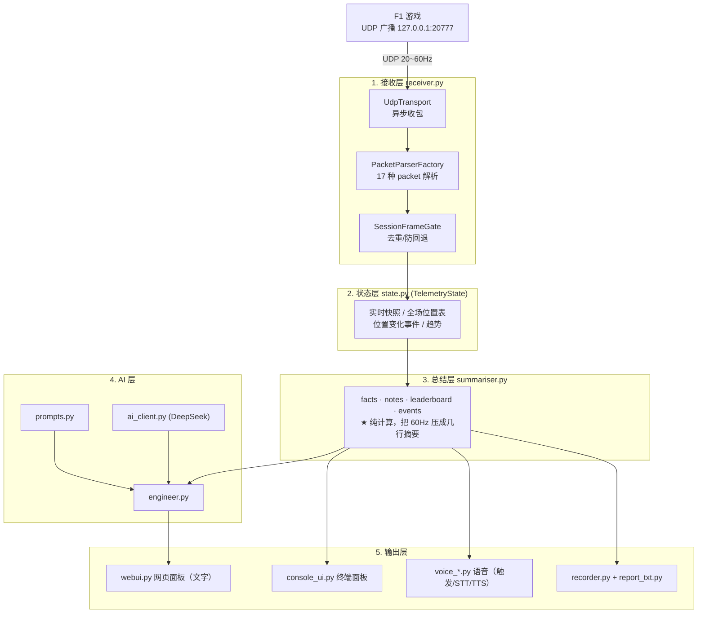

# F1 Race Engineer

> 一个安静运行在后台的 **AI 赛车工程师**：读取 F1 游戏广播的遥测数据，把它压缩成结构化的信息，通过**语音或文字**回答车手的问题，并在**关键时刻主动呼叫**（安全车 / 进站窗口 / 轮胎 / 降雨 …）。

**[ 读遥测 → 本地推演 → 结构化总结 → AI 问答 + 主动播报 ]**

只给情报和建议，**不碰车辆操控**。

---

## 特性

- 🏎 **实时遥测解析** — 支持 F1 2023–2026 全部 17 种 UDP packet，适配 2026 Season Pack（24 车）
- 📊 **全场位置表** — 位置 / 车手 / 圈数 / 轮胎 / 胎龄 / 差距
- ⏱ **圈速分析** — 圈速历史、分段计时、vs 最快圈 delta、无效圈过滤
- ⛽ **油耗策略** — 消耗率、剩余圈数、完赛油量预测
- 🌡 **轮胎 + 损伤** — 胎温（内温中位数，抗重刹尖峰）/胎压/磨损、车损、进站状态
- ⚔ **战况感知** — 位置变化事件，由游戏官方 OVTK 超车事件驱动
- 📡 **主动播报**（v2）— 本地规则引擎，**不调用 LLM**：安全车/红旗/引擎故障即时播；进站窗口/油量/轮胎/降雨在**直道**播；只报窗口和后果，**不下指令**
- 🧮 **推演层**（v2）— Stint 分段、磨损速率、配速衰退、与前/后车差距趋势（追近速率、预计几圈进入 1 秒）、进站窗口状态机、降雨 ETA
- 🎙 **语音问答** — 按键说话（小键盘 + 或手柄按键）→ 本地语音识别 → AI 回答 → 语音播报（可完全离线）
- 🎮 **手柄 PTT**（v3）— DualSense 实测支持、Xbox 已适配：网页一键捕获任意按键生成绑定（普通键 + 十字键方向），按键解读实时显示
- 🗣 **本地识别默认 SenseVoice**（v3）— 非自回归架构，比 whisper-small CPU 快 ~13 倍、中文更准（本机实测 5.1s 音频 0.51s）；`STT_LOCAL_ENGINE` 一键切回 whisper
- 🔤 **TTS 朗读规范化**（v3）— 圈速/差距/温度/名次/百分比自动转可读中文（`1:31.204`→"1分31秒204"），只影响发音不改文本
- 🎧 **观赛模式** — 焦点自动跟随被观看的车辆
- 📝 **会话录制 + 赛后复盘**（v2）— JSON（原始）+ TXT（可读）；过终点自动生成本地复盘 TXT
- 🖥 **双界面 + 配置页**（v2）— 网页面板（含实时功能开关） + 终端面板 + 独立配置页（`FI.py --config`）
- 🔌 **多模型** — 任意 OpenAI 兼容端点（DeepSeek/OpenAI/本地 Ollama…），运行时可切换 + 故障回退
- ⚡ **本地快答** — "我P几/还剩几圈/油够不够/轮胎还能跑几圈/进站窗口"等问题不经过 AI，直接由遥测回答（零延迟、零成本）
- 🎚 **智能档位** — fast / standard / deep 三档，控制回答长度与深度
- 🔊 **音频设备热切换** — 网页面板选麦克风/耳机，拔插后自动重连；本地播报 SAPI（中文音色）/ 离线 Piper
- 💾 **原始包录制/回放**（v2）— `tools/udp_record.py` / `tools/replay.py`（`.f1rec`），离线调参复现

---

## 下载与安装

发布页提供两个包，按需选一个（**推荐先试轻量核心包**）：

| | **轻量核心包** `core` | **全量语音包** `full` |
|---|---|---|
| 体积 | 约 40 MB | 约 1.5 GB（含本地识别模型） |
| 用法 | 解压 → 双击 `F1Engineer.exe`（或 `网页模式.bat` / `语音模式.bat`） | 解压 → 双击 `start.bat`（或 `网页模式.bat` / `语音模式.bat`） |
| Python | 已内置，无需安装 | 已内置（embedded），无需安装 |
| 语音播报 | ✅ 已含 sounddevice/numpy，SAPI（中文音色）可用 | ✅ SAPI + 离线 Piper |
| 语音识别 | 云端 STT（填 key） | **本地识别（SenseVoice/whisper），完全离线** |
| 适合 | 大多数人、首次尝试 | 想离线 / 隐私 / 不想买 STT 额度 |

两个包功能相同，只是语音识别后端不同。AI 未配置 key 时，**名次、圈速、油量、
胎温、损伤、前车差距等高频问题仍可回答**（本地规则，不经过 AI）。

> 下载后请核对发布页 `SHA256SUMS.txt` 中的校验值。

### 从源码运行（开发者）

- **Windows** + **Python 3.12 / 3.13**

```
py -3.12 -m pip install -e .
py -3.12 run.py --web
```

---

## 快速开始（源码）

### 1. 环境

- **Windows**
- **Python 3.12 / 3.13**

### 2. 配置

复制 `.env.example` 为 `.env`，填入你的 API key：

```
LLM_API_KEY=sk-你的key
LLM_BASE_URL=https://api.deepseek.com
LLM_MODEL=deepseek-flash
```

> 支持任意 **OpenAI 兼容**端点。旧的 `DEEPSEEK_*` 变量仍会被读取（作为回退），
> 现有 `.env` 无需改动即可继续使用。

### 3. 游戏设置

F1 游戏内 **设置 → UDP 遥测**：

| 项 | 值 |
|---|---|
| UDP 遥测 | **开启** |
| UDP IP | `127.0.0.1` |
| UDP 端口 | `20777` |
| UDP 赛制 | **2026**（或与你游戏版本对应）|
| 你的遥测 | **受限** ⚠️ |

> ⚠️ **重要**：不要改动"你的遥测"设置。实测改动后会导致 UDP 广播失效（改回来也无法恢复），必须**重启游戏**才能恢复。

### 4. 运行

```
# 网页模式（文字问答）
py -3.12 run.py --web
# 浏览器打开 http://127.0.0.1:8765

# 终端面板
py -3.12 run.py

# 语音模式（见下方"语音功能"）
py -3.12 voice_main.py

# 一键启动（Windows，网页模式）
双击 启动.bat
```

---

## 语音功能（可选）

语音采用**全本地**方案，按键说话，无需常驻监听。

**触发**：游戏中按 **小键盘 +**（默认，按一下开始录音，再按一下结束）或**手柄按键**（网页里一键捕获，见下方"输入源"）

**流程**：按键 → 录音 → 本地语音识别 → AI 问答 → 语音播报

**音频设备**：默认**跟随系统正在使用的设备**——换耳机、换电脑、别人借用都无需任何配置；拔插耳机或切换系统默认设备后，下一次语音自动切到新设备（控制台会打印当前使用的麦克风/播报设备）。想固定某个设备：网页【设置 → 语音设备】选择，或在 `.env` 填 `AUDIO_INPUT` / `AUDIO_OUTPUT`（名字片段即可，`--list-audio` 可列出）。

### 启用步骤

**1. 安装本地语音依赖**（装到项目内的 `stt_lib/`，不污染全局）

```
py -3.12 -m pip install sherpa-onnx sounddevice --target stt_lib
```

**2. 下载语音识别模型**（默认引擎 SenseVoice-Small，约 240 MB，下载到 `stt_models/sensevoice/`）

```
py -3.12 -m tools.download_sensevoice
```

> 想用回 faster-whisper：`py -3.12 -m pip install faster-whisper --target stt_lib`
> + `py -3.12 download_stt_model.py small`，然后 `.env` 设 `STT_LOCAL_ENGINE=whisper`。
> 两者速度对比（本机实测 5.1s 音频）：SenseVoice 0.51s vs whisper-small 6.77s。
> 国内网络若下载失败，先设置镜像：`set HF_ENDPOINT=https://hf-mirror.com`

**3. 运行**

```
py -3.12 voice_main.py
```

**可选参数**：`--input <片段> --output <片段>`（按设备名片段选麦克风/输出）
修改触发键：编辑 `voice_trigger.py` 的 `TRIGGER_VK`（默认 `0x6B` = 小键盘 +）。

> **离线 & 无 CUDA**：本地识别固定用 **CPU int8**（不要求显卡/CUDA 库），
> 模型从项目内 `stt_models/` 读取，不联网、不写 C 盘。
> 播放会自动匹配输出设备（重采样到设备原生采样率、单声道转立体声），
> 适配 G733 这类 8 声道游戏耳机。

**不知道设备叫什么名字？**

```
py -3.12 voice_main.py --list-audio
```

设备也可在 `.env` 里固定（`AUDIO_INPUT` / `AUDIO_OUTPUT`），或在网页面板的
`/api/audio` 运行时切换。设备名找不到时会**明确报错**，不会静默改用系统默认设备
（避免比赛时从音箱外放）。

> `stt_lib/` 和 `stt_models/` 体积较大，已在 `.gitignore` 中排除，需按上述步骤自行下载。

---

## v2 主动工程师（持续观测 + 关键时刻主动呼叫）

v2 把项目从"被动问答"升级为会主动提醒的工程师。核心原则不变：**数值全部本地
计算，AI 只负责措辞**；主动播报**完全不调用 LLM**（零延迟、零成本、行为确定）。

### 主动播报（voice 模式出声，网页模式只显示告警条）

| 配置 | 说明 |
|---|---|
| `RADIO_ENABLE` | 总开关（默认开） |
| `RADIO_VERBOSITY` | 话量：`minimal` / `normal` / `chatty`（默认 chatty） |
| `RADIO_GATE_ENABLE` | 直道时机闸门：只在直道播报（默认开） |
| `RADIO_QUIET_POLICY` | 安静模式：`force_on`（只留安全播报）/ `force_off`（正常，默认）。旧值 `in_game` 等同正常播 |
| `RADIO_BEEP` / `RADIO_FILTER` | 无线电提示音 / 轻度滤波 |

播报内容按优先级：**P0 安全**（安全车/红旗/引擎故障/罚时…，立即播、绕过闸门）、
**P1 策略**（进站窗口/油量/轮胎寿命/降雨…，等直道）、**P2 信息**（位置变化/
最快圈/差距…，等直道、过期丢弃）。**进站只报窗口和后果，绝不下指令。**

**安静模式**：只在配置页锁定 `RADIO_QUIET_POLICY`，局内没有静音快捷键（双击 PTT 静音已取消，否则会和 toggle 的停止录音打架）。

### 推演层（race model）

`race_model.py` 每拍本地计算：Stint 分段、磨损速率、配速衰退、与前后车的差距
趋势（追近速率 / 预计几圈进入 1 秒）、进站窗口状态、降雨 ETA、排位/练习支撑。
结果以 `snapshot["race_model"]` 供总结层与播报层读取，也经 `/api/state` 暴露。

### 赛后复盘（纯本地 TXT，不调 LLM）

过终点（方格旗 / 会话结束 / 最终成绩）且有圈数据时，自动写
`DEBRIEF_DIR`（默认 `sessions/`）→ `debrief_YYYYMMDD_HHMMSS.txt`，含圈速表、
每 stint 均值/衰退、稳定性、进站、关键事件、最终成绩。

### 配置页（独立进程）

```
py -3.12 FI.py --config        # 浏览器打开 http://127.0.0.1:8766
```
可视化修改所有配置，写入 `.env`；运行中的进程自动热加载。密钥只回显末 4 位。

### 设置（网页模式内）

网页面板（`127.0.0.1:8765`）顶部有两个独立入口：
- **AI 设置** —— **预设式**：AI 服务商下拉（DeepSeek/硅基流动/OpenAI/Kimi/Qwen/Ollama，
  选中自动填地址和模型）+ 粘贴 key 即可；下方语音识别区块可选本地识别（默认）或
  云端 API（硅基流动 SenseVoice / OpenAI / 自定义），保存即测连接；
- **功能设置** —— 语音设备、PTT 按键（设备下拉 + 一键捕获 + 实时按键解读）、
  主动播报（开关/话量/差距频率/闸门/提示音）、本地识别模型与线程、
  推演阈值、赛后复盘等，勾选后保存即生效（写入 `.env`，部分项需重启）。

更全的选项（语音包、绑定向导、高级）点「功能设置」里的链接跳到配置页（8766）。

### PTT 与车手名

- **PTT 模式**：`PTT_MODE=hold`（按住说）/ `toggle`（按一下开始再按一下结束，默认）。
- **触发键**：`PTT_BINDING`，格式 `kb:<vk>`（默认小键盘 +）、
  `hid:VID:PID:byte:mask`（通用 HID 手柄普通键）、`hat:VID:PID:byte:value`（十字键方向）
  或 `xi:<button>`（Xbox 走 XInput，如 `xi:a` / `xi:rb` / `xi:dup`）——
  网页【功能设置 → PTT 按键】一键捕获自动生成，旁边实时显示按键解读。
- **车手名念法**：`DRIVER_NAME_STYLE=zh|en|number`（种子表 `data/driver_names.json`）。

### TTS 后端

`TTS_PROVIDER=auto|sapi|piper|off`（本地播报只用 SAPI/Piper，均输出 WAV，无需任何解码器；
播报前有朗读规范化层 `tts_text.py`，圈速/差距/温度/名次/百分比自动转可读中文）：
- `sapi`：Windows 自带，零依赖（中文需系统中文语音包）；
- `piper`：**完全离线**神经语音，需 `pip install "piper-tts[zh]"` 并下载模型
  （`py -3.12 -m tools.download_piper_voice`），设 `TTS_PIPER_VOICE=<.onnx 路径>`；
- `auto`：有 Piper 模型用 Piper，否则 Windows 用 SAPI。

### 原始 UDP 录制 / 回放（离线调试）

```
py -3.12 -m tools.udp_record --port 20777 --out sessions\race.f1rec
py -3.12 -m tools.replay sessions\race.f1rec --port 20777 --speed 2
```

### 输入源（键盘 / 手柄 / 方向盘）

PTT 触发源已模块化到 `inputs/` 包（`inputs/keyboard.py` 键盘、`inputs/hid.py`
通用 HID 手柄/方向盘、`inputs/xinput.py` Xbox XInput、`inputs/base.py` 公共基类，
`input_sources.py` 保留兼容门面）。
**DualSense 手柄已实测支持（USB）**；**Xbox 手柄已适配（走 XInput，待硬件实测）**——
两者都在网页【功能设置 → PTT 按键】选择设备后点【一键捕获】：按住想用的键再松开
即自动生成绑定（DualSense 等 HID 普通键 `hid:VID:PID:byte:mask`、十字键
`hat:VID:PID:byte:value`；Xbox 为 `xi:a` 这类按钮名），
旁边实时显示按键解读，保存后重启语音模式生效；`PTT 模式`（按住 / 按一下开始结束）
同页可选。其他外设的 Raw Input 偏移可用 `py -3.12 -m tools.probe_dualsense`
确认，详见 `KNOWN_ISSUES.md` 的「输入触发方式（PTT）」章节（历史记录，含 DualSense 实测布局）。

### 自检

```
py -3.12 FI.py --selftest      # 依赖/资源/端口/音频/SAPI 音色/LLM 一并检查
```

---

## 网页 API

网页面板（`run.py --web`）同时暴露一组 JSON 接口，方便脚本化或二次开发：

| 方法 | 路径 | 说明 |
|---|---|---|
| GET | `/api/state` | 当前总结 + 接收统计 + 语音状态 |
| POST | `/api/ask` | `{question}` → AI 回答（本地快答优先） |
| POST | `/api/ask_voice` | 上传音频 → 识别 → 回答 |
| GET | `/api/llm` | 当前端点 / 模型 / 档位 / 快答命中率 |
| POST | `/api/llm` | 热切换 `{base_url?, api_key?, model?}` |
| GET | `/api/models` | 列出端点支持的模型 |
| GET | `/api/profile` | 当前档位 + 可用档位 |
| POST | `/api/profile` | 热切换 `{profile: fast\|standard\|deep}` |
| GET | `/api/audio` | 列出麦克风/输出设备 + 当前选择 |
| POST | `/api/audio` | 热切换 `{input?, output?}` |
| GET | `/api/version` | 检查是否有新版本（缓存 6 小时）|
| GET | `/api/export` / `/api/export_txt` | 下载会话报告 |

> **仅本机可用**（即使面板用 `--bind-ip 0.0.0.0` 绑到局域网）：
> 所有配置写入（`/api/llm`、`/api/audio`、`/api/settings`、`/api/bind`、
> `/api/profile`）、提问（`/api/ask`、`/api/ask_voice`）、`GET /api/settings`
> 以及会话导出（`/api/export`、`/api/export_txt`）——非本机一律 403。
> 这样局域网既改不了 key，也花不掉你的额度、导不走会话。
> 页面与 `/api/state`（实时遥测）在局域网仍可只读查看。

**AI 档位**

| 档位 | 特点 | 适用 |
|---|---|---|
| `fast` | 一句话，禁止展开 | 比赛中快速确认 |
| `standard` | 现行默认 | 常规问答 |
| `deep` | 2-3 句，主动给策略权衡 | 冷思考 / 进站规划 |

> 三档只改**表达层**。所有数值计算始终在本地完成，AI 只负责措辞。

### 为什么用 Raw Input / 本地识别？

- **手柄按键**：DualSense/DS5 不是 XInput 设备，改用 Raw Input HID 检测（见 tools/probe_dualsense.py），不依赖 Steam Input/DS4Windows 映射。
- **语音识别默认本地 SenseVoice（可切 whisper / 云端）**，数据不出本机。

---

## 架构


```mermaid
flowchart TD
    GAME["F1 游戏<br/>UDP 广播 127.0.0.1:20777"]

    subgraph L1["1. 接收层 receiver.py"]
        UDP["UdpTransport<br/>异步收包"]
        PARSE["PacketParserFactory<br/>17 种 packet 解析"]
        GATE["SessionFrameGate<br/>去重/防回退"]
        UDP --> PARSE --> GATE
    end

    subgraph L2["2. 状态层 state.py (TelemetryState)"]
        SNAP["实时快照 / 全场位置表<br/>位置变化事件 / 趋势"]
    end

    subgraph L3["3. 总结层 summariser.py"]
        SUM["facts · notes · leaderboard · events<br/>★ 纯计算，把 60Hz 压成几行摘要"]
    end

    subgraph L4["4. AI 层"]
        PROMPT["prompts.py"]
        CLIENT["ai_client.py (DeepSeek)"]
        ENG["engineer.py"]
    end

    subgraph L5["5. 输出层"]
        WEB["webui.py 网页面板（文字）"]
        CONSOLE["console_ui.py 终端面板"]
        VOICE["voice_*.py 语音（触发/STT/TTS）"]
        REC["recorder.py + report_txt.py"]
    end

    GAME -->|"UDP 20~60Hz"| UDP
    GATE --> SNAP --> SUM
    SUM --> ENG
    PROMPT --> ENG
    CLIENT --> ENG
    ENG --> WEB
    SUM --> CONSOLE
    SUM --> VOICE
    SUM --> REC
```

详见 [DESIGN.md](DESIGN.md)。代码评审见 [CODE_REVIEW.md](CODE_REVIEW.md)，已知问题见 [KNOWN_ISSUES.md](KNOWN_ISSUES.md)，迭代记录见 [SUMMARY_v3.md](SUMMARY_v3.md)。

---

## 项目结构

```
F1_TR/
├── FI.py               一键启动（打包入口）：网页 / 语音 / 设置 / 自检，含端口防呆
├── run.py              命令行入口（--web 网页 / 终端面板）
├── paths.py            路径锚点 app_root() / resource_root()（源码 / PyInstaller / 绿色包通用）
├── app.py              组合根：装配 state/receiver/engineer/recorder + ticker/race_model/radio/speech
├── contracts.py        数据契约（Alert / Utterance / Stint / RaceModelState / VoicePack …）
├── config_schema.py    配置项单一真源（类型/范围/默认/分组）
├── config.py           配置中心（.env + 运行时可改，原子写 / 热加载 / 校验）
├── config_ui.py        独立配置页进程（`FI.py --config`，端口 8766）
├── ticker.py           2Hz 分发线程（推演 + 播报 + 热加载 + 复盘触发）
├── race_model.py       推演层：Stint / 配速衰退 / GapTrend / PitWindow / 天气
├── radio_fx.py         无线电提示音 + 轻滤波（numpy）
├── radio_rules.py      主动播报规则表（按赛段）
├── radio_templates.py  主动播报中文模板（禁进站祈使句）
├── radio_director.py   规则引擎 + 时机闸门 + 去重冷却（无 LLM）
├── speech.py           唯一语音出口：SpeechArbiter + 非阻塞 AudioPlayer
├── voices.py           语音包 + TTS provider 注册表（SAPI / Piper）
├── names.py            车手名渲染（中文 / 英文 / 车号）
├── inputs/             PTT 输入源包（base / bindings / keyboard / hid / xinput）
├── input_sources.py    输入源兼容门面（转发到 inputs/ 包）
├── tts_text.py         TTS 朗读规范化（圈速/名次/温度/百分比 → 可读中文）
├── ptt_controller.py   PTT 状态机（hold / toggle）
├── debrief.py          赛后复盘（本地 TXT，无 LLM）
├── voice_main.py       语音入口（走 build_app，含 PTT 与主动播报）
├── receiver.py         单进程 UDP 收包 + 解析调度（含 raw_sink 录制钩子）
├── state.py            遥测状态聚合（冻结快照 / 位置表 / 事件时间轴 / 每圈快照 / flashback 回滚）
├── summariser.py       总结层：facts（含命名空间）+ notes
├── llm_client.py       OpenAI 兼容客户端 + make_llm（多端点 / 回退）
├── profiles.py         AI 档位（fast/standard/deep）+ 本地快答路由
├── audio.py            音频设备解析（列出 / 模糊匹配 / 热切换）
├── prompts.py          系统提示词 + 快照文本构造（按意图选命名空间）
├── engineer.py         问答引擎
├── webui.py            网页 UI（含功能开关面板 + 告警条）
├── console_ui.py       终端 UI
├── recorder.py         会话录制
├── report_txt.py       TXT 报告生成
├── stt_client.py       语音识别客户端（云端 / 本地 whisper）
├── tts_client.py       TTS 合成（SAPI / Piper）
├── voice_trigger.py    Raw Input 按键触发（不注入/不挂钩）
├── voice_stt.py        本地 faster-whisper 识别 + 录音
├── voice_tts.py        TTS 播放 shim（委托 speech.AudioPlayer）
├── build_manifest.py   打包清单单一真源（模块 / 资源 / hidden-import）
├── build_release.ps1   构建两个发布包（轻量 exe + 全量语音包）
├── 整体测试.bat        自检 + 运行测试（[7] 离线 / [8] 含网络音频）
├── 网页模式.bat / 语音模式.bat / start.bat / voice.bat   一键启动
├── data/               只读资源（driver_names.json 等）
├── tools/              开发工具（udp_record / replay / probe_dualsense / download_sensevoice…）
├── tests/              pytest 测试套件（tests/conftest.py 注入路径）
├── sandbox/            Windows Sandbox 干净机器验收器（make_wsb.py + .wsb）
├── lib/                核心库（第三方解析层，只读）
│   ├── f1_types/           17 种 F1 packet 解析（2023–2026）
│   ├── socket_receiver/    UDP 传输
│   ├── telemetry_manager/  解析工厂 + 帧门
│   ├── delta/              圈速 delta
│   └── fuel_rate_recommender.py / rolling_history.py
├── stt_lib/            本地语音依赖（sherpa-onnx / faster-whisper / sounddevice / piper，全量包自带）
├── stt_models/         本地 whisper 模型（全量包自带）
├── piper_models/       离线 Piper 模型（可选）
└── sessions/           自动生成的会话记录与复盘（运行时产生）
```

---

## 测试

```powershell
py -3.12 -m pytest -q                        # 离线套件（含 loopback UDP）
$env:RUN_NETWORK_TESTS=1; py -3.12 -m pytest # 追加需真实音频设备的用例
```

也可双击 `整体测试.bat`：`[A]` 自检、`[7]` 离线测试、`[8]` 全部测试。
`FI.py --selftest` 会逐项检查依赖 / 资源 / 端口 / 音频设备 / SAPI 中文音色 / `.env` / LLM。

---

## 兼容性

| 维度 | 支持范围 | 备注 |
|---|---|---|
| 操作系统 | Windows 10 1809+ / 11 x64 | Raw Input / SAPI / http.server 均原生 |
| 游戏 | F1 23 / 24 / 25 / 26（packet 2023–2026） | 未知新格式会被丢弃并计数，不会崩溃 |
| CPU（本地语音） | 需 AVX 指令集，**不需要显卡/CUDA** | 固定 CPU int8；老 CPU 可改用云端 STT（`STT_PROVIDER=cloud`）|
| 语音零依赖路径 | 云端 STT + SAPI 播报 | 纯标准库，轻量核心包即可用 |
| AI | 任意 OpenAI 兼容端点 | DeepSeek / OpenAI / Moonshot / Qwen / 本地 Ollama |
| 端口 | UDP `20777` | 与 SimHub / CrewChief **互斥**（单消费者），同时用需转发 |
| 网络防火墙 | 绑定 `127.0.0.1` 不触发弹窗 | `--bind-ip 0.0.0.0` 会弹，属正常 |

---

## 会不会封号？（FAQ）

**结论：本项目当前形态在 EA AntiCheat 下的风险接近于零。**

- **只被动接收官方 UDP 广播**。UDP 遥测是游戏设置里的官方功能，SimHub / CrewChief
  等工具以此生态存在多年；收包不与游戏进程发生任何交互。
- **按键检测用 Windows Raw Input**（`RIDEV_INPUTSINK`），是**只读**的标准 API ——
  不注入、不挂钩（不 `SetWindowsHookEx`）、不装驱动、不映射输入。
- **外置窗口**，不做游戏内注入式 overlay（DX hook / ReShade 类）。
- **绝不**读写游戏内存、不模拟输入、不绕过反作弊。

反作弊的封禁画像（DLL 注入、读内存、合成输入、内核驱动）与本项目无关；普通的
置顶窗口（Discord / Steam / OBS 类）也不属于该画像。

> ⚠️ 两点提醒：
> 1. 反作弊不管你，**不等于**赛事规则允许。**线上排位 / 联赛请自行确认赛事规则**。
> 2. 打包版本采用 onedir + 版本元数据（非 onefile 自解压），尽量避免被杀软误伤。

---

## 非目标

明确**不做**：

- ❌ 车辆操控（按键模拟 / 手柄注入 / 内存修改）
- ❌ 读取或修改游戏进程内存
- ❌ 绕过反作弊
- ❌ 提供游戏本身不广播的数据

本项目**只被动接收**游戏官方广播的 UDP 数据；语音按键用 Raw Input **只订阅、不干预**输入。

---

## 技术栈

- **Python 3.12**，接收/解析/HTTP 服务/语音播放全部基于 **标准库 + 少量可选本地依赖**
- 任意 **OpenAI 兼容端点**提供语言能力（DeepSeek / OpenAI / Moonshot / Qwen / 本地 Ollama…）
- **faster-whisper** 提供本地语音识别（可选，CPU int8，无需 CUDA）
- 遥测解析复用 [pits-n-giggles](https://github.com/ashwin-nat/pits-n-giggles)（MIT）

---

## License

MIT。复用 pits-n-giggles 的模块遵循其 MIT 许可，详见 [LICENSE](LICENSE)。

## 致谢

- [pits-n-giggles](https://github.com/ashwin-nat/pits-n-giggles) — F1 遥测解析库
- [faster-whisper](https://github.com/SYSTRAN/faster-whisper) — 本地语音识别
- [DeepSeek](https://deepseek.com) — AI 语言能力
